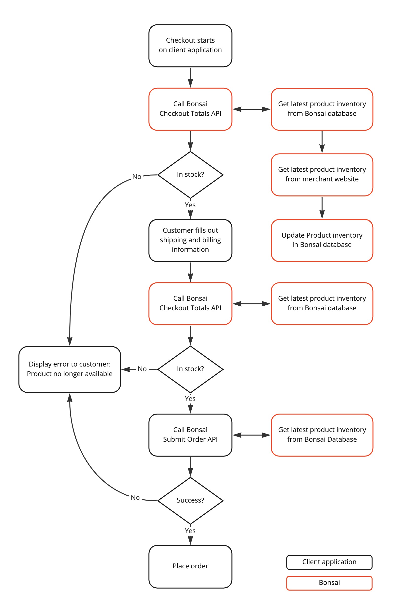

# Inventory Validation

This page contains information about product inventory validation. 
This feature provides live inventory checks to increase order success rate when product information gets outdated.

## Who is this for
We currently only support inventory validation for some of our merchants. 
Verify with your account manager, as this is considered a feature only implemented for merchants providing slower inventory updates leading to success rates below expectations.

## How can a user buy an out-of-stock product
A customer can buy an out-of-stock product when the following scenario occurs:

1. Product inventory changes on the merchant's website, and the product becomes unavailable
2. Merchant updates their product feed
3. Bonsai ingests the merchant's latest product feed
4. Bonsai updates the product feed, which gets ingested by you
5. Customer views the product on your application and attempts to purchase it

Bonsai works hard to reduce the time between merchants updating their product feed in step 2 and getting this updated product information into the feeds ingested by clients.

Even with the most optimized flow, we depend on how frequently the merchant updates their product feed. If this happens once a day, chances are higher for a customer to purchase an out-of-stock product.

Usually, frequently updated merchant feeds have a higher order success rate. As a result, by the time the end user purchases the product, the product will still be in stock and ready for fulfillment.

## How validation works
For merchants providing a lower inventory update frequency, 
Bonsai delivers a custom solution validating product availability during checkout.

When performing a checkout API call (`/checkout`) to Bonsai, 
we'll return the latest inventory within our system and automatically check for the newest product information if the merchant has checkout validation configured. 
However, since checking for live information often takes longer than expected from our checkout API endpoint, we need to handle this **asynchronously**.

The first time you call our Checkout API, it might not return the latest product information, 
as there's a delay between retrieving the newest product information from the merchant's system, 
storing it and returning an API response.

After an unknown time (primarily within seconds), the latest product validation will be complete, and a subsequent call to `/checkout` will include the most up-to-date information.

:::note
Suppose a product gets marked as unavailable. 
In that case, there will be no further inventory checks during checkout, and the product will stay unavailable until the next cycle when we receive merchant product updates.
:::

Here's how the checkout flow looks in this case:
1. Customer adds a product to their cart
2. Call [checkout totals API endpoint](../api/orders/checkout-totals.api.mdx). Inventory validation begins asynchronously
3. Allow the user to enter the billing and shipping information
4. Call Bonsai [checkout totals API endpoint](../api/orders/checkout-totals.api.mdx) again. The inventory validation results are in, providing the most up-to-date product availability information based on the merchant's system
5. Call Bonsai [submit order API endpoint](../api/orders/submit-orders.api.mdx) to place an order which will validate against the latest product information in our system (up-to-date after Step 2. completes)

## Checkout flow diagram

[comment]: # (Edit diagram https://miro.com/app/board/uXjVPxSArFY=/)
